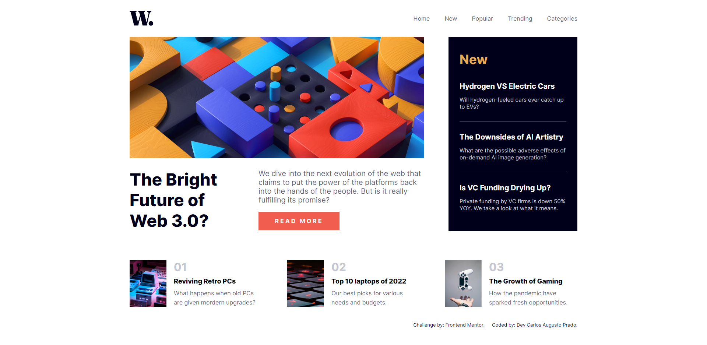

# Frontend Mentor - News homepage solution

This is a solution to the [News homepage challenge on Frontend Mentor](https://www.frontendmentor.io/challenges/news-homepage-H6SWTa1MFl). Frontend Mentor challenges help you improve your coding skills by building realistic projects. 

### The challenge

Users should be able to:

- View the optimal layout for the interface depending on their device's screen size
- See hover and focus states for all interactive elements on the page
- **Bonus**: Toggle the mobile menu (requires some JavaScript)

### Screenshots

### Links

- Solution URL: [GitHub](https://github.com/CarlosAugustoPrado/NewsHomepage-FrontEndMentor)
- Live Site URL: [Netlify](https://news-homepage-fem-carlosaugustoprado.netlify.app)

### Built with

- Semantic HTML5 markup
- CSS custom properties
- Flexbox
- CSS Grid
- Gulp
- SASS

### What I learned

Very useful site to practice HTML, CSS and a bit of JavaScript.

## Author

- Website - [Carlos Augusto Prado](https://github.com/CarlosAugustoPrado)
- Frontend Mentor - [@CarlosAugustoPrado](https://www.frontendmentor.io/profile/CarlosAugustoPrado)
- LinkedIn - [@CarlosAugustoPrado](https://www.linkedin.com/in/carlosaugustoprado/)

